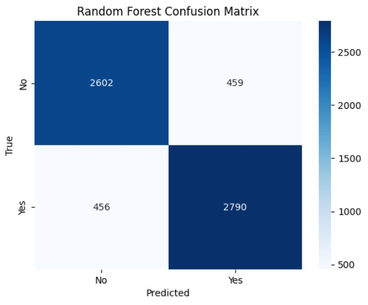
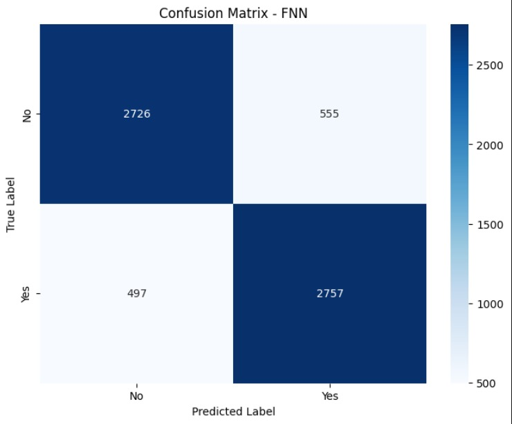
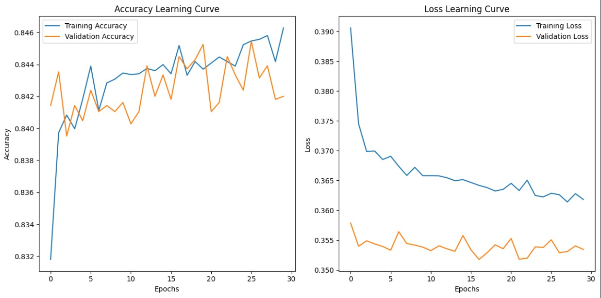
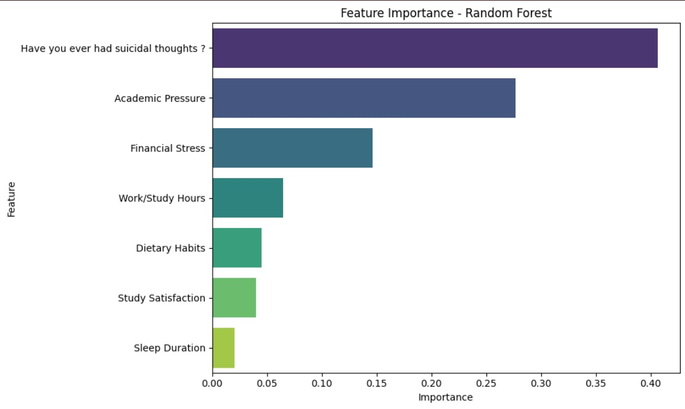
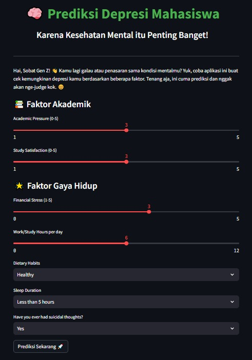
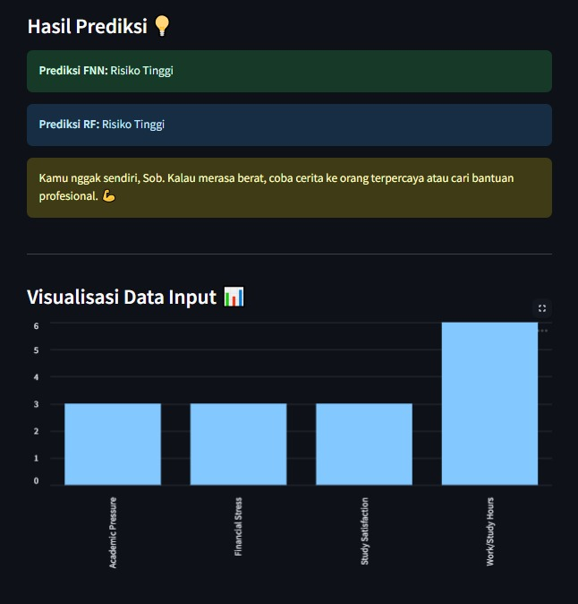

<p align="center">
  
</p>

# ✨ Prediksi Depresi Mahasiswa: Analisis Faktor Akademik dan Gaya Hidup dengan RF dan FNN ✨

## 📖 Deskripsi Proyek  
Proyek ini bertujuan untuk mengembangkan sistem prediksi risiko depresi mahasiswa berdasarkan faktor akademik dan gaya hidup. Sistem ini mengintegrasikan model machine learning **Random Forest** (RF) dan **Feedforward Neural Network** (FNN) untuk memberikan hasil prediksi yang akurat dan dapat dijadikan referensi awal.  

---

## 📂 Dataset & Models  
Dataset yang digunakan mencakup data mahasiswa dengan atribut seperti tekanan akademik, stres keuangan, kebiasaan makan, durasi tidur, dan lainnya. Dataset ini terdiri atas **6.535 data** yang telah diproses dengan pembagian:  
- 70% sebagai *Training Set*.  
- 15% sebagai *Validation Set*.  
- 15% sebagai *Testing Set*.  

### Klik Link untuk Mengakses Dataset & Model:
- [](https://www.kaggle.com/datasets/hopesb/student-depression-dataset?resource=download)
- [Model RF dan FNN](Model/)

---

## 🛠️ Fitur Utama  
- **Prediksi Risiko Depresi:**  
  Model memprediksi apakah seseorang berada pada risiko rendah atau tinggi depresi berdasarkan data masukan.  

- **Model yang Digunakan:**  
  - **Random Forest (RF):** Menggunakan ensemble learning untuk menangkap hubungan kompleks antar fitur.  
  - **Feedforward Neural Network (FNN):** Memanfaatkan arsitektur jaringan saraf untuk prediksi berbasis hubungan non-linear.  

- **Visualisasi Hasil:**  
  Menampilkan **Confusion Matrix**, **Classification Report**, **Learning Curve**, dan **Feature Importance** untuk memahami performa model.

---

## ⚙️ Instalasi  
Ikuti langkah-langkah berikut untuk menjalankan proyek ini:  

1. **Clone repository ini:**  
   ```bash
   git clone https://github.com/your-repository.git
   cd your-repository
   ```

2. **Buat environment Python virtual & aktifkan:**  
   ```bash
   python -m venv venv
   venv/Scripts/activate #Windows
   source venv/bin/activate #macOS/Linux
   ```

3. **Install dependencies:**  
   ```bash
   pip install -r requirements.txt  
   ```

4. **Jalankan aplikasi Streamlit:**  
   ```bash
   streamlit run app.py  
   ```

5. **Akses aplikasi melalui browser di alamat berikut:**  
   ```bash
   http://127.0.0.1:8501   
   ```

---

## 📊 Evaluasi Model  

### Confusion Matrix  
**Random Forest:**  
  
 Matriks ini menunjukkan bahwa model Random Forest mampu mengklasifikasikan sebagian besar data dengan baik, dengan sedikit kesalahan pada kelas positif dan negatif.

**Feedforward Neural Network:**  
  
 Model FNN sedikit lebih lemah dalam mengklasifikasikan kelas negatif dibandingkan Random Forest, namun tetap memberikan hasil yang kompetitif.

### Classification Report  

**Random Forest**:  
| Class | Precision | Recall | F1-Score | Support |
|-------|-----------|--------|----------|---------|
| 0     | 0.86      | 0.84   | 0.85     | 3281    |
| 1     | 0.84      | 0.86   | 0.85     | 3254    |
| **Accuracy**       |         |         | **0.85**     | 6535    |
| **Macro Avg**      | 0.85    | 0.85    | 0.85     | 6535    |
| **Weighted Avg**   | 0.85    | 0.85    | 0.85     | 6535    |

 Model RF memiliki performa yang seimbang dengan precision dan recall yang baik di kedua kelas.

**Feedforward Neural Network**:  
| Class | Precision | Recall | F1-Score | Support |
|-------|-----------|--------|----------|---------|
| 0     | 0.85      | 0.83   | 0.84     | 3281    |
| 1     | 0.83      | 0.85   | 0.84     | 3254    |
| **Accuracy**       |         |         | **0.84**     | 6535    |
| **Macro Avg**      | 0.84    | 0.84    | 0.84     | 6535    |
| **Weighted Avg**   | 0.84    | 0.84    | 0.84     | 6535    |

 Model FNN sedikit tertinggal dari RF dalam hal akurasi keseluruhan, namun tetap memiliki performa yang baik dengan hasil yang konsisten.

### Learning Curve  

**Feedforward Neural Network:**  
  
 Model FNN menunjukkan performa yang fluktuatif pada data testing, menunjukkan potensi overfitting yang memerlukan tuning lebih lanjut.

### Feature Importance  
Feature importance dari model Random Forest:  
  
 Fitur "Have you ever had suicidal thoughts?" adalah yang paling berpengaruh terhadap prediksi, diikuti oleh tekanan akademik dan stres keuangan.

---

## 🔐 Local Web Deployment  

Aplikasi web ini dirancang menggunakan **Streamlit**, framework Python yang sederhana dan interaktif. Dengan antarmuka yang intuitif, pengguna dapat memasukkan data faktor akademik dan gaya hidup untuk mendapatkan prediksi risiko depresi.

### Tampilan Aplikasi  
- **Input User**:  
  Halaman ini menyambut pengguna dengan deskripsi singkat tentang tujuan aplikasi. Pengguna diarahkan untuk memasukkan inputan yang sudah disediakan.
    

- **Hasil Prediksi**:  
  Setelah data dimasukkan, aplikasi menampilkan hasil prediksi secara langsung, lengkap dengan model yang digunakan (RF dan FNN) serta tingkat kepercayaan model.  
    

Aplikasi ini mudah diakses dan dapat dijalankan di lingkungan lokal tanpa konfigurasi yang kompleks. Hasil prediksi disajikan secara jelas untuk mendukung pengguna dalam memahami kondisi mereka.

---

## 🕵️‍♂️ Kesimpulan  
- **Random Forest** menunjukkan akurasi sedikit lebih tinggi dibanding FNN, tetapi kedua model memiliki performa yang kompetitif.  
- **Feature importance** membantu memahami faktor utama yang memengaruhi prediksi.  
- Proyek ini dapat dikembangkan lebih lanjut dengan memperkaya dataset dan menambahkan fitur interpretasi hasil prediksi.  

---

## 📧 Author  
[BagusW](https://www.instagram.com/baguswicaksonoo__/)  

